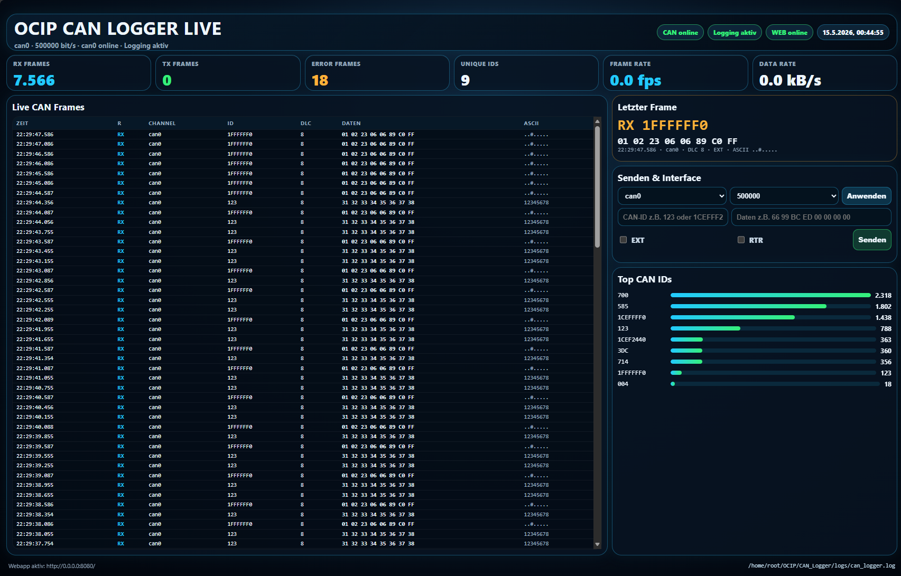
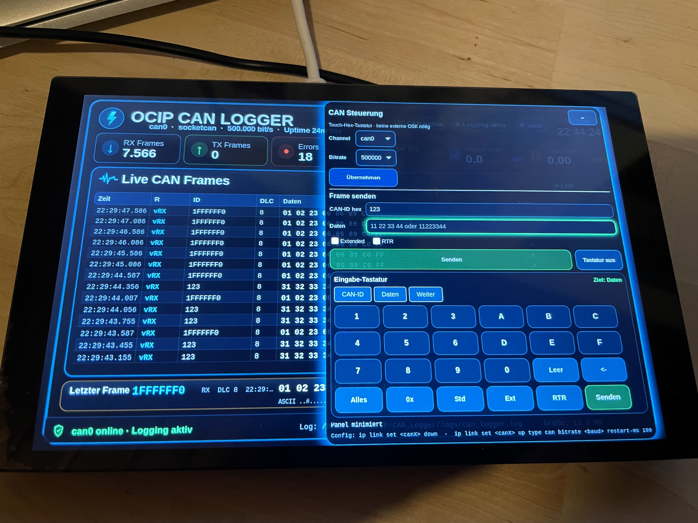

# OCIP CAN Logger

Moderner CAN-Logger für Linux-/Yocto-Systeme mit **GTK4-Touch-Oberfläche**, **SocketCAN-Unterstützung**, **CAN-TX-Steuerung** und einer **integrierten Live-Weboberfläche**.



## Überblick

Der **OCIP CAN Logger** ist eine Python-Anwendung für die Erfassung, Visualisierung und Protokollierung von CAN-Daten. Das Projekt kombiniert eine lokal laufende **GTK4-Kiosk-/Touch-UI** mit einer parallel verfügbaren **Web-App**, sodass CAN-Traffic sowohl direkt auf dem Gerät als auch remote im Browser überwacht und gesteuert werden kann.

Die Anwendung richtet sich besonders an Embedded-, Test-, Service- und Diagnose-Umgebungen, in denen eine robuste und direkt bedienbare CAN-Überwachung benötigt wird.

## Hauptfunktionen

- **SocketCAN-Logging** über `python-can`
- **GTK4 Dashboard** für Touchscreens und Kiosk-Systeme
- **Integrierte Weboberfläche** für Live-Monitoring im Browser
- **CAN-Frames senden** direkt aus der App oder der Weboberfläche
- **Interne Hex-Tastatur** für Yocto-/Touch-Systeme ohne externe Bildschirmtastatur
- **Live-Statistiken** wie RX/TX-Frames, Fehlerframes, Datenrate und eindeutige CAN-IDs
- **Mehrformat-Logging** in:
  - `can_logger.log` (candump-ähnlich)
  - `can_logger.csv`
  - `can_logger.asc` (ASC-ähnlich)
  - `can_logger_stats.json`
- **Log-Rotation** mit konfigurierbarer Maximalgröße und Backup-Anzahl
- **CAN-Interface-Konfiguration** per `ip link`
- **CAN-Filter-Unterstützung**
- **Vollbild-/Windowed-Betrieb**

## Architektur

Das Projekt besteht im Wesentlichen aus vier Bereichen:

### 1. CAN-Kommunikation
Ein eigener Worker-Thread liest CAN-Nachrichten über `python-can` vom SocketCAN-Interface und verarbeitet diese fortlaufend. Zusätzlich können CAN-Frames aktiv gesendet werden.

### 2. Logging
Alle empfangenen und gesendeten Frames werden parallel in mehreren Formaten gespeichert. Dadurch eignet sich das Tool sowohl für schnelle Sichtprüfungen als auch für spätere Auswertungen in Tabellen oder Analysewerkzeugen.

### 3. GTK4-Oberfläche
Die Desktop-/Kiosk-Oberfläche visualisiert Live-Daten, Statistiken, letzte Frames und erlaubt das Konfigurieren des CAN-Interfaces sowie das Senden eigener Nachrichten.

### 4. Web-Dashboard
Ein eingebauter HTTP-Server stellt zusätzlich ein responsives Dashboard bereit. Darüber lassen sich Live-Daten abrufen, CAN-Nachrichten senden und Basisparameter wie Kanal und Bitrate ändern.

## Dateien im Repository

- `ocip_can_logger.py` – Hauptanwendung mit Logger, GTK4-UI und Webserver
- `ocipcanlogger.png` – Hauptbild / Vorschau des Projekts
- `ocip_can_logger_1.png` – Screenshot / zusätzliche Projektansicht
- `ocip_can_logger_2.jpeg` – weiteres Bild / zusätzliche Projektansicht
- `LICENSE` – Lizenzdatei
- `README.md` – Projektdokumentation

## Voraussetzungen

### Systempakete
```bash
sudo apt install python3-gi gir1.2-gtk-4.0 python3-cairo python3-gi-cairo
```

### Python-Abhängigkeit
```bash
pip install python-can
```

## Starten

### Standardstart
```bash
python3 ocip_can_logger.py
```

### Mit CAN-Interface-Konfiguration
```bash
python3 ocip_can_logger.py --channel can0 --bitrate 250000 --configure-can
```

### Im Fenster statt Vollbild
```bash
python3 ocip_can_logger.py --windowed --log-dir /tmp/canlogs
```

### Mit Weboberfläche auf Port 8080
```bash
python3 ocip_can_logger.py --web-host 0.0.0.0 --web-port 8080
```

Danach ist die Weboberfläche typischerweise unter folgendem Schema erreichbar:

```text
http://<gerät-ip>:8080
```

## Wichtige Kommandozeilenoptionen

- `--channel` – z. B. `can0`
- `--interface` – Standard: `socketcan`
- `--bitrate` – Bitrate für optionales Interface-Setup
- `--configure-can` – konfiguriert das CAN-Interface beim Start per `ip link`
- `--restart-ms` – Restart-Zeit für SocketCAN
- `--log-dir` – Zielverzeichnis für Logdateien
- `--max-bytes` – maximale Dateigröße vor Rotation
- `--backups` – Anzahl der Backup-Dateien
- `--filter` – CAN-Filter, z. B. `123:7FF,1CEFFF24:1FFFFFFF`
- `--windowed` – startet die Anwendung im Fenster statt im Fullscreen
- `--web-host` / `--web-port` – Host und Port der Weboberfläche
- `--no-web` – deaktiviert die Weboberfläche

## Ausgabeformate

### `can_logger.log`
Textbasiertes, `candump`-ähnliches Log für schnelles Debugging.

### `can_logger.csv`
Tabellarisches Exportformat für Excel, LibreOffice, Python oder Datenanalyse-Workflows.

### `can_logger.asc`
ASC-ähnliches Format zur Weiterverwendung in bekannten Automotive-Toolchains.

### `can_logger_stats.json`
Laufende Status- und Statistikdaten, z. B. für externe Auswertung oder Monitoring.

## Bedienkonzept

### GTK4-/Touch-Oberfläche
Die lokale Oberfläche ist für Touch-Geräte optimiert und eignet sich für Kiosk- oder Panel-PC-Setups. Besonders hilfreich ist die **eingebaute Hex-Tastatur**, da auf Yocto-Systemen häufig keine externe Bildschirmtastatur verfügbar ist.

### Weboberfläche
Die Web-App stellt Live-Daten, Statusinformationen, Top-IDs und eine Sende-/Konfigurationsmaske bereit. Dadurch kann das Gerät auch remote beobachtet und teilweise gesteuert werden.

## Typischer Einsatz

- Diagnose an Embedded-Linux-Systemen
- CAN-Monitoring im Labor oder Fahrzeugumfeld
- Service- und Testsysteme
- Yocto-basierte Touchpanels
- Protokollierung und spätere Analyse von CAN-Kommunikation

## Hinweise für Yocto / Embedded

Dieses Projekt ist besonders gut für **Yocto- oder Kiosk-Systeme** geeignet, weil:

- keine externe On-Screen-Tastatur benötigt wird
- die UI auf Touch-Bedienung ausgelegt ist
- die Weboberfläche ohne zusätzliche externe Frameworks läuft
- Logging, Anzeige und Senden in einer einzigen Anwendung kombiniert sind

## Screenshots

### Hauptansicht


### Weitere Ansicht


## Technische Zusammenfassung

Die Anwendung verwendet:

- **Python 3** als Programmiersprache
- **GTK4 / PyGObject** für die grafische Oberfläche
- **python-can** für die CAN-Anbindung
- **SocketCAN** als Linux-CAN-Backend
- **integrierten Python-HTTP-Server** für das Web-Dashboard

## Kurzbeschreibung

Der **OCIP CAN Logger** ist ein vollständiges CAN-Monitoring- und Logging-Werkzeug für Linux/Yocto. Er verbindet eine moderne Touch-Oberfläche mit Live-Webzugriff, Multi-Format-Logging und direkter CAN-Sendefunktion in einer einzigen Anwendung.

## Lizenz

Dieses Projekt enthält eine `LICENSE`-Datei im Repository.
